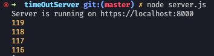
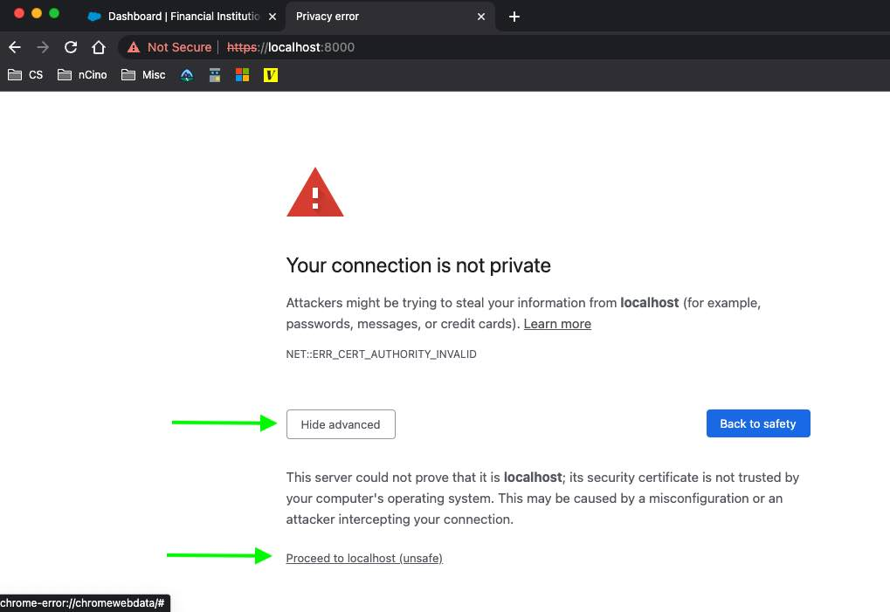

# nPORTAL Session Timeout Component

Congratulations! You have been tasked with working on the ~~elusive~~.. ~~exclusive~~.. no... ~~confusive~~.. wait, still no - **_Timeless_**, yes timeless Session Timeout Component. Follow these steps below and you'll be off and timing out in no time.

## Setup

1) We'll need to setup ssl for our local server so Salesforce will play nice with it.
	- you want to run the following code in sequence to create your permissions
	```bash
	# in root directory
	openssl genrsa -out key.pem
	openssl req -new -key key.pem -out csr.pem
	openssl x509 -req -days 9999 -in csr.pem -signkey key.pem -out cert.pem
	rm csr.pem
	```

2) Now let's actually try running the server. To do that run
	- ```bash
		# in root directory
		node server.js
		```
	- you should now see output of your localhost url and a countdown commence
	

3) With those steps out of the way we need your browser to accept our weird little unauthenticated/authenticated local site. To do this:
	- open up your browser and type or paste in our host url (don't miss the http**s**)
	- you'll be presented with a nasty "_YoUR ConnEcTiON iS nOt PRIvaTe_" message. Simply click `Show advanced`, and then `Proceed to localhost`
	

4) Now you're ready to modify some things in the [nPORTAL/session/lwc/sessionTimeout/sessionTimeout.js](https://github.com/ncino/force-nPORTAL/blob/sessionTimeoutMockConfig/src/nPORTAL/session/lwc/sessionTimeout/sessionTimeout.js) file and start timing out 🤙

### Notes
1) reset timer url
2) https://github.com/ncino/force-nPORTAL/blob/sessionTimeoutMockConfig/src/nPORTAL/session/lwc/sessionTimeout/sessionTimeout.js